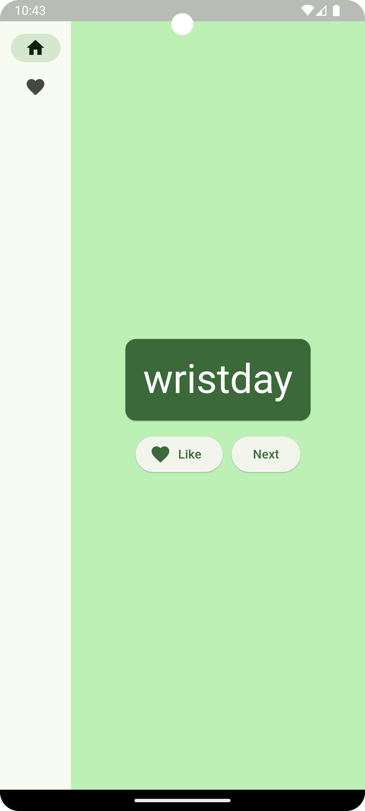
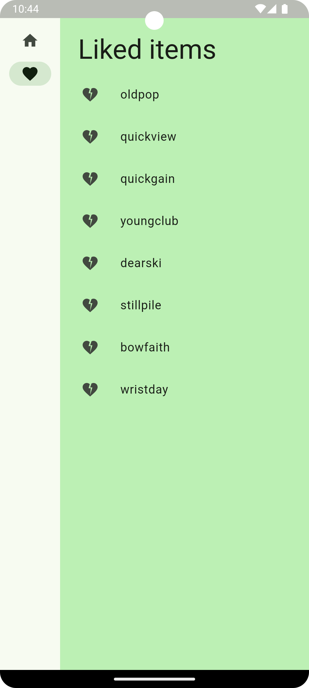
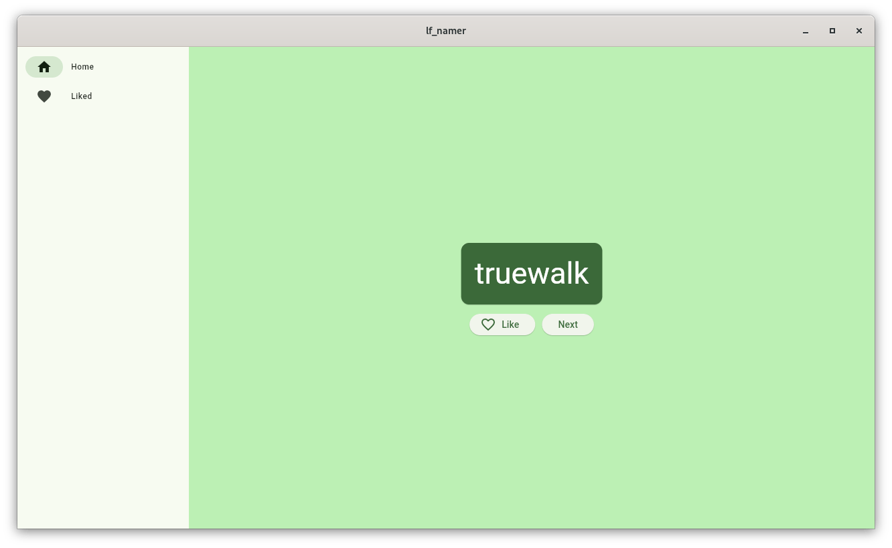
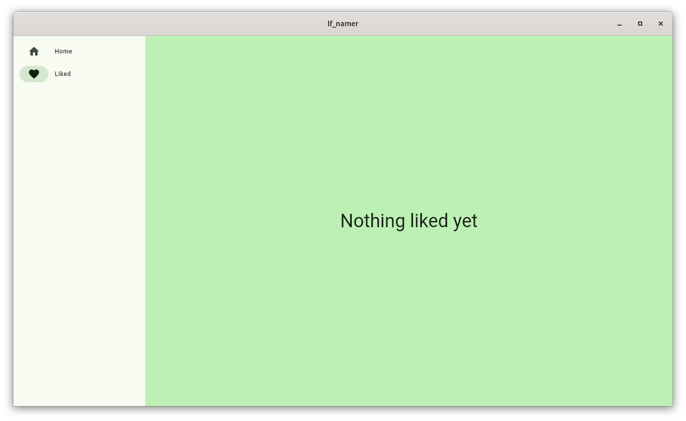
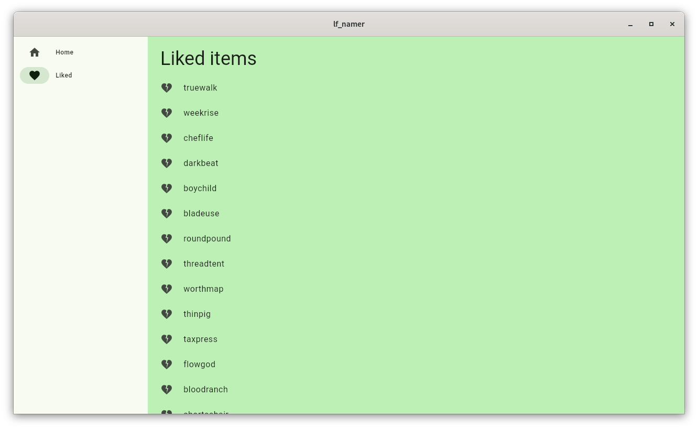

# Namer app

Namer generates words consisting from two nouns with a possibility to like a word
or generate next one. It also shows liked words as a list and allows to unlike any.

Project is Flutter based and can be compiled for Windows, Linux, OS X, IOS, Android and Web.

## Screenshots

1. Mobile main and liked items pages. Here are a generated word, like button and next button. Liked
   items shows the list of liked items with dislike buttons.
 
   

      

         
      

      

         
      

   

2. Desktop main page

   

3. Desktop empty liked page

   

4. Desktop liked words page with liked items

   

## Running the app

Use Android studio with Flutter and Dart plugins set up to run the app.

